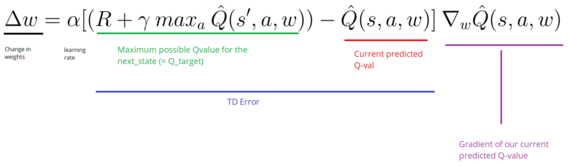
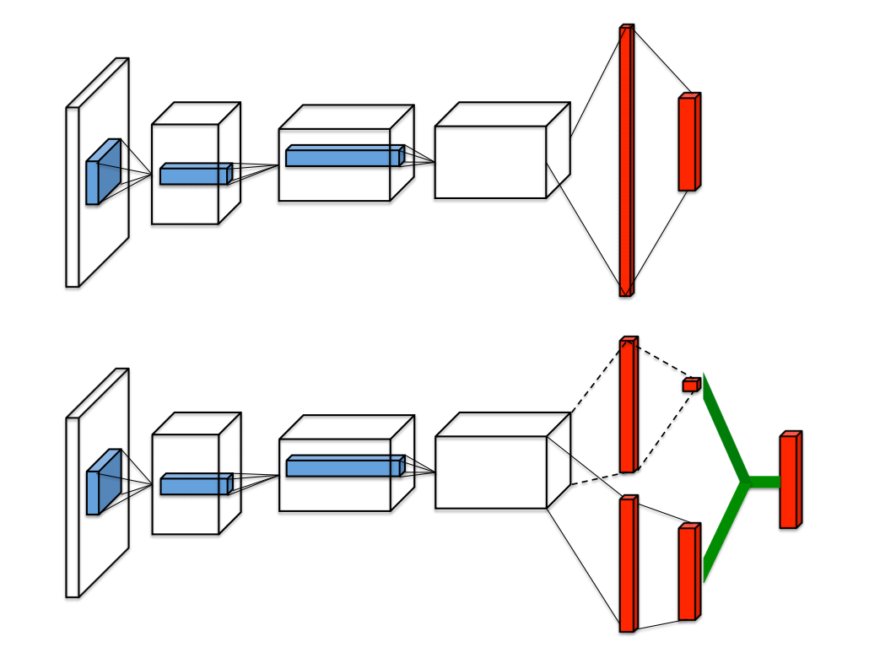
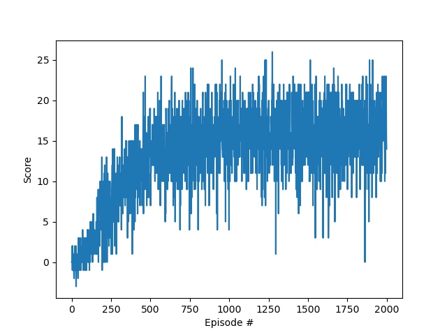

# Deep Reinforcement Learning

### Project 1: Navigation in banana envirornement

##### Overview:

The aim of this project is to train an agent to learn how to navigate in the banana evironmenet by collecting yellow bananas and avoid blue ones. In this report i explain my implementation, starting from DQN and improving it using Double DQN and Dueling DQN after understanding these two papers:

- Double DQN: https://arxiv.org/pdf/1509.06461.pdf
- Dueling DQN: https://arxiv.org/pdf/1511.06581.pdf

#### Architecture:

- ###### DQN:

  In RL, we always want to get the best policy in our environment for a particular task. As a way, to learn this best policy, we should find a way to maximise the future rewards. So, we learn how good are we in a particular state take a particular action; this is the state-action value Q, we save them in a table and we try to pick the best combinations of actions that maximize it. This is tabular Q-Learning.
  At some point, we found out that in most of our problems we have a big number of actions states combinations, and tabular representation can not be efficient anymore. As an idea, instead of learning the exact value of each combination, we try to to find an approximation function, complex enough to represent all the possible values of Q. And this is the DEEP Q-Learning. We can see the DQN as Q-Learning, but instead of finding the values in a table, we predict them using a Deep Neural Network. The DQN has the weights parameter θ and tries to learn to choose an optimal action. A trick that they introduced in the paper, is to keep track on a certain experiences in the past, and update on a batch of them, not only one experience. We store these experiences in a replay memory D that countains the tuple  (s, a, r, s').

- ###### Double DQN:

  Using DQN the update would not be stable, because in the update, the target and the network to update are the same. Thus in Double DQN, we use two similar neural networks 'local' and 'target'. The first one learns during the experience replay and the second one is a copy of an older version of the local and just used to calculate the target Q value. As the formula shows, the local network is to get the best Q value and use its index in the target network to get the best action.
  

- ###### Dueling DQN:

  Dueling DQN has a really powerful idea, I think it did not really help in my case because my states are discrete, but if I used the pixels states it would definetly more sense and it is really worth trying even in my case. Duel DQN only changes the model architecture, so we can apply all the techniques learned in DDQN. We will compute the value state function Q(s,a) as the sum of the Value function V(s) and an Advantage function A(s,a). Q tells how good are we in state s taking the action a. V tells how good are we in state s.Thus, the advantage function subtracts the value function from the Q function to obtain how important is each action.
  

#### Code description:

- model.py : definition of the model architechture for Simple and Dueling networks.
- dqn.py : implementation of DQN algorithm
- agent.py : implementation of agent using DQN and Double DQN methods.
- Navigation.ipynb : start environment, test it, train agent and plot scores.

#### Hyperparameters:

- BUFFER_SIZE = int(1e5)          # replay buffer size
- BATCH_SIZE = 64                 # minibatch size
- GAMMA = 0.99                    # discount factor
- TAU = 1e-3                      # for soft update of target parameters
- LR = 1e-4                       # learning rate
- UPDATE_EVERY = 4                # how often to update the network

#### Results:

#### Future Work:

To improve the agent, we can add Prioritized Experience Replay, to replay important transitions more frequently, and therefore learn more efficiently. 
