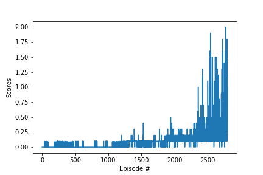

# Deep Reinforcement Learning

### Project 2: Collaboration and Competition

##### Overview:

The aim of this project is to train two agents to learn how to play Tennis. In this report i explain my implementation, starting from DDPG and adapting to be able to work on two agents, collaborate and compete after understanding these papers:

- DDPG: https://arxiv.org/pdf/1509.02971.pdf 
- Multi Agent DDPG: https://papers.nips.cc/paper/7217-multi-agent-actor-critic-for-mixed-cooperative-competitive-environments.pdf
#### Architecture:

- ###### DDPG:

  In RL, we always want to get the best policy in our environment for a particular task. As a way, to learn this best policy, we should find a way to maximise the future rewards. There came Deep Learning methods to learn Q functions scalable and able to represent a lot of combinations states and actions.
  The problem with DQN methods is that they are not able to scale to actions that have a lot of dimensions and freedom and continuous space. Although it is possible to scale DQN to continous space actions, by discretizing the space to small portions, which will have a lot of output for the Neural netwok, it is somehow impossible to apply that if we have a lot of degree of freedoms.
  Here comes the idea of Continuous Control with DDPG.
  The writers of the algorithm consider DDPG as actor critic method. An actor is a neural network that represents the policy; decides an action from a given state. The critic is a neural network that represents the Q; which gives the Q value given an action and a state.
  So as given in the below figure, given a state , the actor network predicts the best believed action. This is a deterministic policy here. We take that action and give it as input with the state and predicts the Q value.
  In order to have stochastic policy, we need to apply a distribution on the action predicted by the actor network. This is how we apply the exploration by adding some noise sampled a noise process. We can see it as adding a Gaussian distribution on the action value. In the paper, we are using noise sampled from Ornstein-Uhlenbeck process.

- ###### Multi Agent DDPG:

  In this project, we are having two different agents, each of them is a DDPG object. Each one has its own updates and buffer replay, it is just that everyone having information about the state of the other. 
  

#### Code description:

- model.py : definition of the model architechture.
- ddpg_agent.py : implementation of agent using ddpg.
- tennis.ipynb : multi_ddpg core main function, start environment, test it, train agent and plot scores. 

#### Hyperparameters:

- BUFFER_SIZE = int(1e6)          # replay buffer size
- BATCH_SIZE = 256                 # minibatch size
- GAMMA = 0.99                    # discount factor
- TAU = 1e-3                      # for soft update of target parameters
- LR_ACTOR = 1e-3  # learning rate of the actor
- LR_CRITIC = 1e-3  # learning rate of the critic
- WEIGHT_DECAY = 0  # L2 weight decay
- UPDATE_EVERY = 20  # timesteps between updates
- EPSILON = 1.0  # epsilon for the noise process added to the actions
- EPSILON_DECAY = 1e-6  # decay for epsilon above

#### Results:

 

#### Checkpoint:
the two checkpoints are checkpoint_critic_1, checkpoint_actor_1, checkpoint_critic_2 and checkpoint_actor_2
#### Future Work:

To improve the agent, we can add Prioritized Experience Replay, to replay important transitions more frequently, and therefore learn more efficiently. Or trying to have the same buffer replay.
